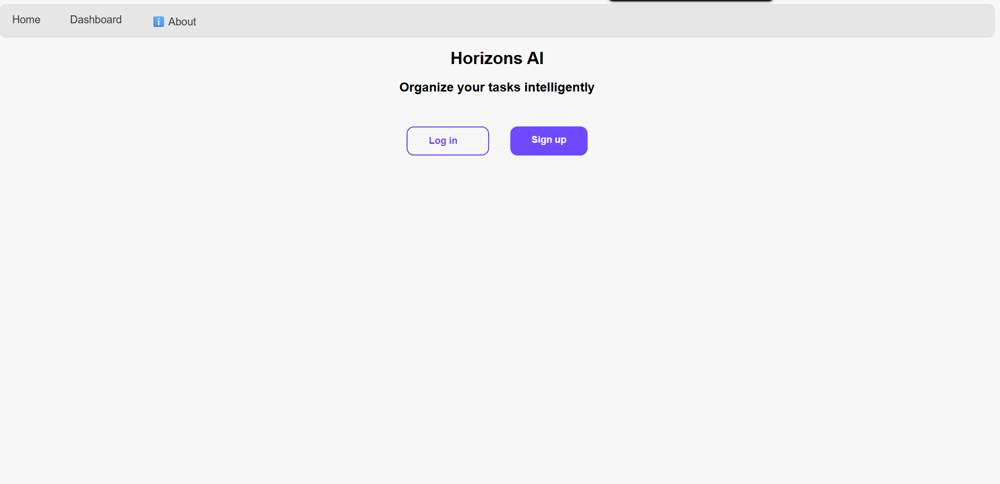
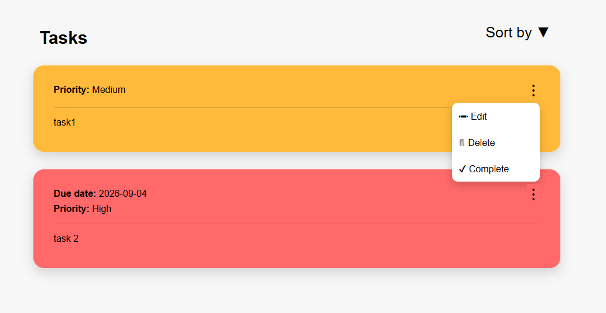
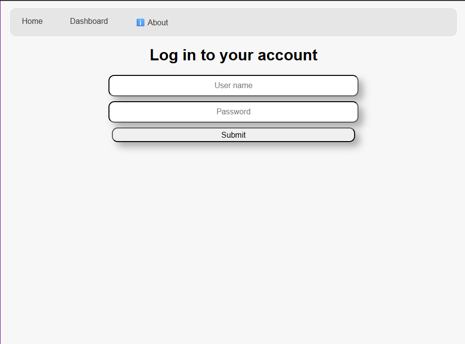
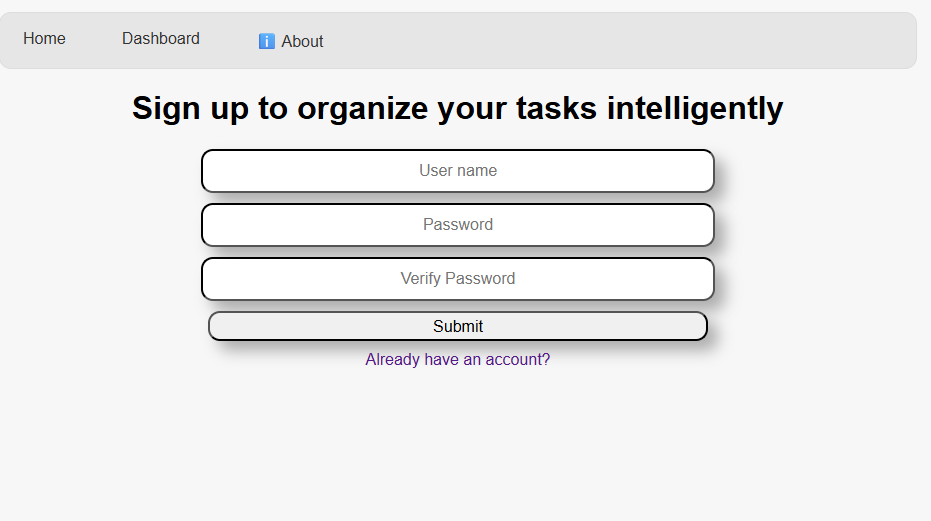
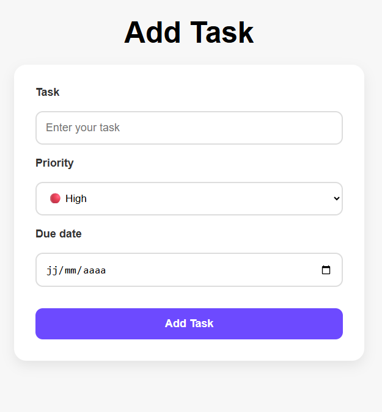
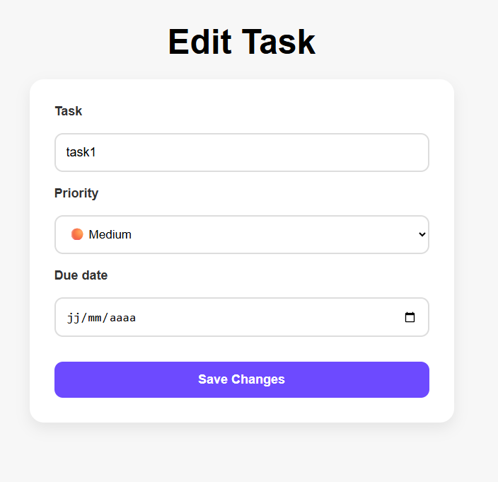

# Horizons AI


  
 An intelligent, responsive task management platform built with Flask.

--------------

## Why I built it
The idea for this project came to me several months ago when I discovered GitHub and the open-source community. At the time, I was learning Python in my free time and wanted to build a real project instead of just following tutorials.

The first version was a simple terminal application where users managed their tasks by choosing options with indexes like (y/n). I was proud of it because it was my first complete project, but I knew I could make it better.

For the second version, I redesigned the interface so users interacted with the application through terminal commands, similar to Git. Although it was an improvement, I still wanted to transform it into a real web application. Unfortunately, I didn't have enough motivation at the time, and I was also busy with exams.

Later, while scrolling through social media, I discovered Hack Club and learned about Horizons. It gave me the motivation to finally build the web version of my project.
During development, I migrated the application from CSV file storage to a SQLite database using SQLAlchemy to improve scalability and data management.

--------------

## Features

*   **🔐Secure Authentication:** sign-up, log in,log out, and protected personal task dashboards.
*   **✅Task Management:** Full CRUD operations easily add, edit, and delete tasks.
*   **🚩Smart Organization:** Assign task priorities, set due dates.
*   **📱Responsive Interface:** A clean, modern user interface optimized for desktop and mobile screens.

--------------

## How it works
Each user has a personal account protected by password hashing.
After logging in, users can:
Create new tasks.
Assign a priority (High, Medium, or Low).
Set an optional due date.
Edit or delete existing tasks.
Sort tasks by priority, due date, or alphabetical order.

All data is stored in a SQLite database using SQLAlchemy, ensuring that every user's tasks remain private.

--------------


## Technologies
* Flask
* SQLite
* SQLAlchemy
* HTML5, CSS3, JavaScript

--------------

## Installation & Setup
clone the repository:
```bash
git clone https://github.com/82936473/Horizons-AI.git
```
install the requirements:
```bash
pip install -r requirements.txt
```
the the Application:
```bash
python main.py
```
--------------

## Future improvements
* AI task assistant.
* Task completion. Done
* Add notifications.
* multiple languages
* Dark mode.
* More reactif componenets. Done

--------------
## Live Demo
[text](https://horizons-ai-production.up.railway.app/)

--------------


## Some Screenshots
|Home|Dashboard|
|----|---------|
|||

| Log in | Sign up |
|---------|----------|
|||

|Add Task|Edit Task|
|--------|---------|
|||

--------------

## What I learned During This Project
During this project, I learned:

- Flask routing
- HTML & CSS
- SQLAlchemy and SQLite
- User authentication
- Password hashing
- Responsive web design
- Git and GitHub workflow